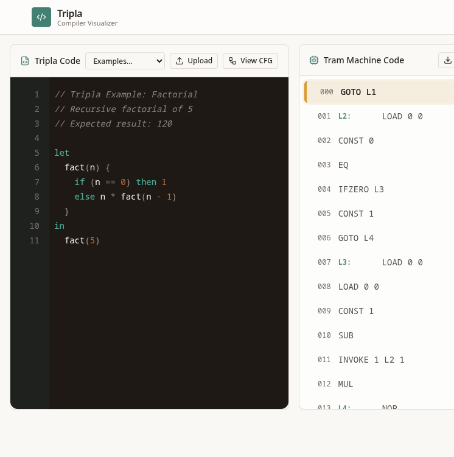

# Tripla — Compiler Visualizer

Interactive learning tool for the **Tripla** language and **TRAM** abstract machine. Write Tripla, compile it to machine code, step through execution, and watch the runtime stack — based on a compilers lecture at Trier University.



## Features

- **Workspace** — edit Tripla, compile to TRAM, step / run / reset, inspect PC · PP · FP · TOP and the stack
- **CFG viewer** — control-flow graph of the compiled program
- **Learn TRIPLA** — language features, grammar reference, and construct wiki
- **Compiler Concepts** — pipeline overview (scanner → code generator)

## Quick start

```sh
npm install
npm run dev
```

Open the URL Vite prints (default `http://localhost:8080`).

```sh
npm run build    # production build → dist/
npm run preview  # serve the build locally
```

## Project layout

```
src/
  components/   UI (editor, machine view, stack, learn helpers)
  content/      Tripla examples, grammar, wiki, compiler phases
  lib/tripla/   Lexer, parser, compiler, abstract machine
  pages/        Workspace, Learn, Compiler Concepts
```

## Tech

React · TypeScript · Vite · Tailwind CSS · shadcn/ui

## License

Private course project unless otherwise noted.
