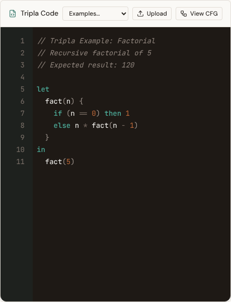
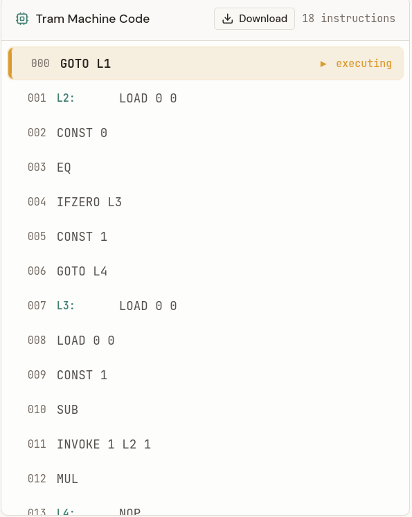
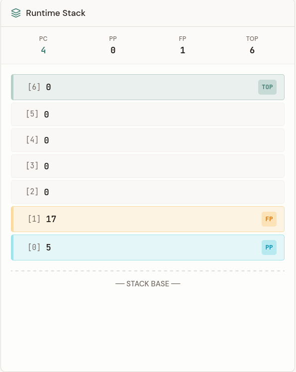
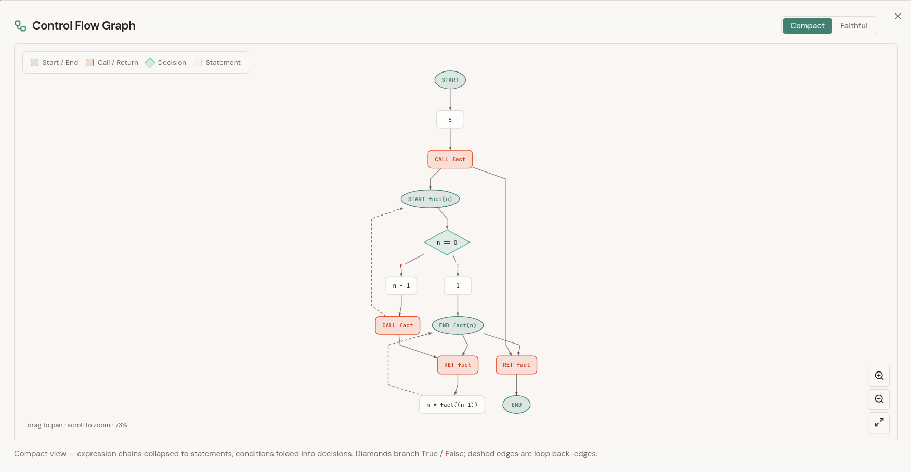

# Tripla

A project to visualize the basics of compiler concepts — write Tripla source, compile it to TRAM machine code, step through execution, and inspect the runtime stack. Based on the lecture *Compiler Design* at the University of Trier, held by Prof. Dr. Stephan Diehl.

## Features

### Write Tripla code

Edit programs in the Tripla language, load examples, or upload a file.

  

### Compile to TRAM

Compile your source into TRAM instructions and step through them one by one.

  

### Watch the stack

See registers and the runtime stack update as the program runs.

  

### Control-flow graph

Open the CFG view to explore how control flows through the compiled program.

  

